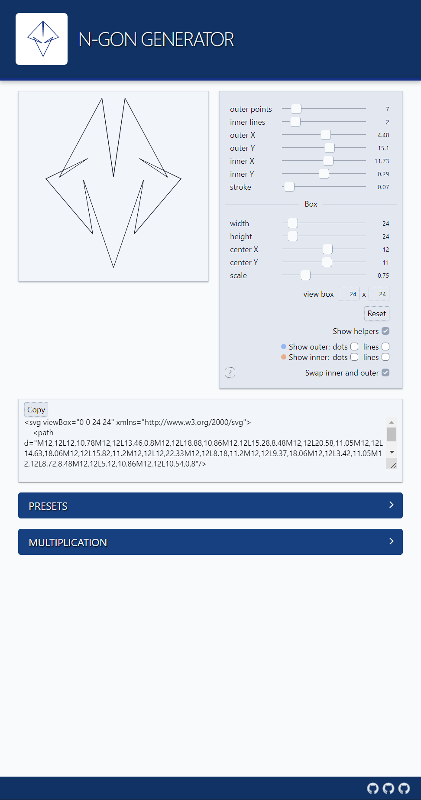
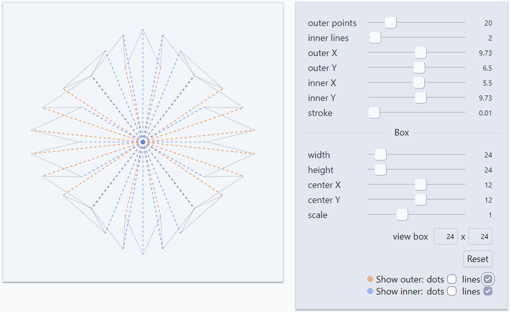

### About

WIP. N-gon generator

### Refs, Credits, Links

* [Interactive artwork based on Delaunay triangulation](https://twitter.com/loackme_/status/1518324084224012290)
* [Plotting Spirographs](https://twitter.com/KilledByAPixel/status/1518379589638230016)
* [Pyramid rotation](https://twitter.com/incre_ment/status/1518408838466076673)
 